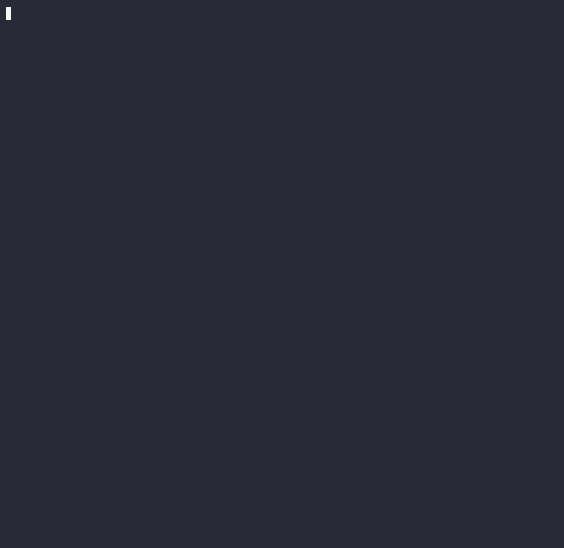
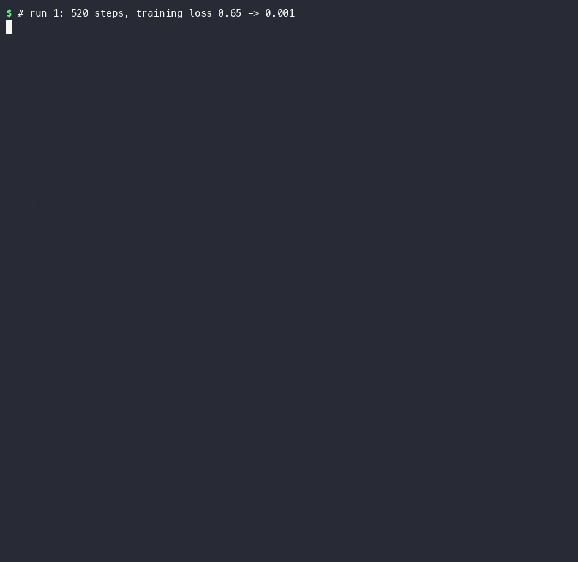

<h1 align="center">
  <picture>
    <source media="(prefers-color-scheme: dark)" srcset="docs/assets/trainjudge-logo-dark.svg">
    <source media="(prefers-color-scheme: light)" srcset="docs/assets/trainjudge-logo-light.svg">
    
  </picture>
</h1>

<h4 align="center">Decide whether fine-tuning is the right fix, then verify it actually worked,<br>on held-out task metrics and general skills, not training loss.</h4>

<p align="center">
  <a href="https://github.com/Himanshukurrey/trainjudge/actions/workflows/ci.yml"></a>
  <a href="pyproject.toml"></a>
  <a href="pyproject.toml"></a>
  <a href="LICENSE"></a>
  <a href="#training"></a>
  <a href="notebooks/trainjudge_colab.ipynb"></a>
  <a href="#using-it-from-claude-code"></a>
</p>

<p align="center">
  <a href="#why">Why</a> •
  <a href="#what-it-caught-on-the-demo">Results</a> •
  <a href="#install">Install</a> •
  <a href="#quickstart">Quickstart</a> •
  <a href="#how-it-works">How it works</a> •
  <a href="#domain-packs">Domain packs</a> •
  <a href="#limitations">Limitations</a>
</p>

<p align="center">
  
</p>

Before you fine-tune, TrainJudge tells you whether fine-tuning is even the right move.
After you fine-tune, it tells you whether it actually worked.

## Why

Training loss going down is the least informative number in a fine-tune. A model can drive
it to zero by memorizing its training data, get better at the task while forgetting how
to follow basic instructions, or be fine-tuned for something that never needed it. Facts
that change belong in retrieval; unclear instructions belong in the prompt.

TrainJudge checks both ends:

- **Before training:** `diagnose` sorts the request into a knowledge, format/behavior,
  cost/latency or prompt-engineering gap, with the evidence for each score, and says
  "don't fine-tune" when that's the right answer. The dataset audit flags duplicates,
  malformed rows, low-quality answers and sensitive identifiers (card numbers, Aadhaar,
  PAN, UPI IDs and more).
- **After training:** `verify` compares the base model and the fine-tuned one on a
  held-out test split and a built-in general-capability suite, and issues IMPROVED,
  REGRESSED or REJECTED. Every number traces back to saved examples.

## What it caught on the demo

Five real LoRA fine-tunes of `Qwen3-0.6B` on the same [text-to-SQL demo](demo/sql_generation/),
on an M-series Mac. Every one of them drove training loss down, and they earned three different verdicts.

| Run | Train loss | SQL accuracy (held-out, n=130) | Instruction-following | Format compliance | Verdict |
|---|---|---|---|---|---|
| 520 steps, rank 16 | 0.65 → 0.001 | 30.8% → 97.7% | 77% → **47%** | 100% → **50%** | ⚠ REGRESSED |
| 120 steps, rank 8 | 0.75 → 0.005 | 30.8% → 96.2% | 77% → **63%** | 100% → **89%** | ⚠ REGRESSED |
| 150 steps, rank 8, `--replay 208` | 0.67 → 0.05 | 30.8% → 98.5% | 77% → 77% | 100% → 94% | ✓ IMPROVED |
| 30 steps, lr 2e-6, rank 4 | 2.31 → 1.54 | 30.8% → 40.0% (p = 0.029) | 77% → 77% | 100% → 100% | ✓ IMPROVED |
| 20 steps, lr 1e-6, rank 4 | 2.37 → 2.30 (val 2.39 → 2.11) | 30.8% → **24.6%** | 77% → 77% | 100% → 100% | ✗ REJECTED |

The first run is the classic trap: near-zero loss and near-perfect SQL, but the model
now answers "write 3 bullet points" with one bullet, drifts into Chinese mid-answer and
leaks SQL habits into unrelated questions ("SELECTED: 11,000"). Mixing the base model's
own answers to general prompts back into training (`--replay`) kept those skills intact.

The last run is the opposite trap: training and validation loss both fell, so the loss
curve looks like progress, but the model got worse at the task (11 questions lost, 3
gained). A small but real gain from an equally light run (30 steps) still counts as
IMPROVED, because the verdict comes from held-out results, not from how much training
happened.

Read the full reports: [regressed](demo/sql_generation/example-runs/regressed/EXPERIMENT_REPORT.md),
[improved with replay](demo/sql_generation/example-runs/improved-with-replay/EXPERIMENT_REPORT.md)
and [rejected](demo/sql_generation/example-runs/rejected/EXPERIMENT_REPORT.md).



The demo data is synthetic and template-generated, which is why accuracy climbs so high
so fast. The point is the verdicts, not the numbers.

## Install

Pick the extra for your machine:

| Machine | Install | Training runs on |
|---|---|---|
| Apple Silicon Mac | `pip install "trainjudge[mlx] @ git+https://github.com/Himanshukurrey/trainjudge"` | MLX (fastest on a Mac) |
| Windows or Linux with an NVIDIA GPU | install [PyTorch with CUDA](https://pytorch.org/get-started/locally/), then `pip install "trainjudge[cuda] @ git+https://github.com/Himanshukurrey/trainjudge"` | PyTorch on CUDA |
| No GPU | [the Colab notebook](notebooks/trainjudge_colab.ipynb) runs everything on a free NVIDIA T4, or install `[cuda]` for a (slow) CPU run | PyTorch |

`diagnose`, `audit` and `status` run anywhere with no extras. For development:

```bash
git clone https://github.com/Himanshukurrey/trainjudge && cd trainjudge
pip install -e ".[dev,mlx]"    # or .[dev,cuda]
pytest
```

### Using it from Claude Code

Install the bundled plugin so Claude Code runs the diagnose → train → verify workflow
itself whenever you ask it to fine-tune something (the CLI above must be on your `PATH`).
Run this from the terminal CLI; `/plugin` commands aren't available in the VS Code
extension:

```
/plugin marketplace add Himanshukurrey/trainjudge
/plugin install trainjudge@trainjudge
```

The skill tells Claude to diagnose before training, ask before starting a long job, keep
you posted with `trainjudge status` while it runs, and report the verdict as-is.

### Using it from Codex and other agents

[AGENTS.md](AGENTS.md) at the repo root describes the same workflow for Codex and any
agent that reads `AGENTS.md`. The engine is a plain CLI, so any agent that can run shell
commands can use it.

## Quickstart

```bash
# 1. Should this be fine-tuned at all?
trainjudge diagnose --dataset demo/sql_generation/data.jsonl --model Qwen3-0.6B \
  --goal "improve SQL generation for our shop database"

# 2. Train (cleans the data, holds out a test split, LoRA on MLX or PyTorch)
trainjudge train --dataset demo/sql_generation/data.jsonl --model Qwen3-0.6B \
  --iters 150 --learning-rate 2e-5 --rank 8 --num-layers 8 --replay 208

# 3. Did it actually work?
trainjudge verify trainjudge-runs/<run> --db demo/sql_generation/shop.sql

# Anytime: what's running, and how far along is it?
trainjudge status
```

## Commands

```
trainjudge diagnose --dataset <path> --model <name> --goal "<text>"
trainjudge audit <path>
trainjudge train --dataset <path> --model <name>
trainjudge eval <run-dir> [--db <database>]      # --db for SQL tasks only
trainjudge verify <run-dir> [--db <database>]
trainjudge status [<run-dir>]
```

## How it works

### Diagnosis: should you fine-tune at all?

`trainjudge diagnose` runs before any training. It reads the goal and the dataset and
sorts the request into one of four gaps:

| Gap | What it means | Recommendation |
|---|---|---|
| Knowledge | The model lacks facts (policies, rates, product details) | ❌ Use retrieval, not fine-tuning |
| Format/behavior | The model needs to learn an output format or convention (SQL, JSON, labels, tone) | ✓ Fine-tune |
| Cost/latency | A big model already does the task; you want it cheaper or faster | ✓ Distill into a small model |
| Prompt engineering | Few-shot prompting or clear instructions haven't been tried yet | ❌ Fix the prompt first |

Signals come from the goal text and from the dataset itself: the output shape (SQL,
JSON, code, labels or prose), whether answers state numbers that aren't in the question,
how many prompts share the same answer, whether answers are grounded in context given in
the prompt, whether rows cite a source document, and the dataset size. Every point a
bucket earns is shown as evidence. When two buckets score close together, the output
says the goal is mixed.

```
$ trainjudge diagnose --dataset demo/policy_docs/data.jsonl --model Qwen3-0.6B \
    --goal "make it answer from our internal support policy documents"
TRAINJUDGE DIAGNOSIS

Goal: make it answer from our internal support policy documents
Model: Qwen3-0.6B
Dataset: 236 examples (question → prose answer pairs citing source documents)

Classification: KNOWLEDGE GAP   (confidence: high)
...
Evidence:
  • goal mentions "documents", "policy", "internal" +1 more
  • completions are free-form prose answers
  • 78% of answers state numbers, dates or amounts that aren't in the
    question
  • 216 prompts map to only 36 distinct answers, so the dataset teaches
    recall of fixed facts
  • only 23% of answer words appear in the prompt; the facts have to come
    from the model's weights
  • 100% of rows cite a source document

Recommendation: ❌ Do not fine-tune for this goal.
```

Pass `--tried-prompting` or `--not-tried-prompting` if you know, and `--json` for
machine-readable output. The JSON output includes every signal and score so a coding
agent can review the call.

### Sensitive data

Every dataset is scanned, whatever the domain. Fine-tuned models can memorize and repeat
training data, so `train` refuses to run on flagged data. `--mask-sensitive` replaces each
identifier with a placeholder (`[EMAIL]`, `[MRN]`, `[CARD]`…) and trains on the masked
rows, keeping labels like "MRN:" readable. `trainjudge audit --write-clean OUT
--mask-sensitive` writes a masked copy instead, and `--allow-sensitive-data` trains on the
raw data if you really mean to. Detected identifiers:

| Region | Identifiers |
|---|---|
| Global | payment card numbers (Luhn-checked), IBANs (mod-97-checked), international phone numbers, email addresses |
| India | Aadhaar (Verhoeff-checked), PAN, UPI IDs, mobile numbers |
| US | Social Security numbers (issuance rules checked), formatted phone numbers |
| UK | National Insurance numbers |
| Any | bank account numbers, medical record numbers and dates of birth, when labelled as such |

The report lists line numbers only, never the values, and points to the relevant rules
for what it found (for example PCI DSS for cards, India's DPDP Act 2023 for Aadhaar, GDPR
for IBANs and HIPAA for medical record numbers). These are pointers, not legal advice.

### Domain packs

The diagnose → train → verify core works for any task. A **domain pack** adds what's
specific to one industry, and diagnosis picks one automatically from the goal and the
data (`--domain` forces one, or `--domain none` turns it off):

- **Facts that change:** goals about them lean towards retrieval over versioned documents
- **High-stakes decisions:** goals like approving loans or triaging patients get a
  human-in-the-loop and bias warning
- **Domain notes:** for example keeping the report for model-risk review

| Pack | Knowledge-gap signals (→ retrieval) | High-stakes decisions flagged | Demos: fine-tune · retrieval |
|---|---|---|---|
| **Healthcare** | clinical guidelines, drug dosing, formularies, coverage | diagnosis, triage, prescribing, prior authorization | [clinical coding](demo/domains/healthcare/clinical_coding/) · [formulary Q&A](demo/domains/healthcare/formulary_faq/) |
| **Legal** | case law, statutes, regulations by jurisdiction | legal advice, bail/parole, immigration, custody | [clause extraction](demo/domains/legal/clause_extraction/) · [statutes Q&A](demo/domains/legal/statutes_faq/) |
| **E-commerce/retail** | prices, stock, promotions, catalog details | fraud flags, account/seller suspension, refund denial | [product attributes](demo/domains/ecommerce/product_attributes/) · [catalog Q&A](demo/domains/ecommerce/catalog_faq/) |
| **Customer support** | help-center articles, policies, plans, SLAs | refund denial, account closure | [ticket triage](demo/domains/customer_support/ticket_triage/) · [help-center Q&A](demo/domains/customer_support/help_center_faq/) |
| **HR/recruiting** | benefits, pay bands, handbooks, employment law | candidate screening and ranking, termination | [resume parsing](demo/domains/hr/resume_parsing/) · [benefits Q&A](demo/domains/hr/benefits_faq/) |
| **BFSI** | interest rates, charges, KYC rules, regulator circulars | loan/credit and claim decisions | [transactions](demo/domains/bfsi/transactions/) · [loan FAQ](demo/domains/bfsi/loan_faq/) |
| **Education** | syllabi, exam dates, deadlines, admission rules | grading, admissions, misconduct findings | [question tagging](demo/domains/education/question_tagging/) · [course Q&A](demo/domains/education/course_faq/) |

Every pack has two demos: a structured-output task where fine-tuning fits, with
domain-typical sensitive identifiers planted in it (medical record numbers, emails, dates of
birth, card numbers and so on), and a Q&A over that domain's documents where diagnosis
recommends retrieval instead. All organizations, people, drugs and statutes in them are
fictional. The [SQL demo](demo/sql_generation/) is detected as e-commerce (it's a shop's order
database) and the [policy-docs demo](demo/policy_docs/) as customer support.

A pack is one small Python file. See [Adding a domain pack](CONTRIBUTING.md#adding-a-domain-pack),
or [request one](https://github.com/Himanshukurrey/trainjudge/issues/new?template=domain_pack.yml).

### Dataset audit

`trainjudge audit` reads JSONL in any of mlx-lm's formats (`prompt`/`completion`,
`messages`, or `text`) and gives each row exactly one status:

- **malformed:** invalid JSON or UTF-8, or missing, empty or non-string fields
- **duplicate:** same prompt and completion as an earlier row, ignoring case, whitespace
  and trailing punctuation
- **low-quality:** refusals, placeholders (`TODO`, `N/A`), completions that repeat the
  prompt, and degenerate repetition
- **clean:** everything else

It also warns when the same prompt has conflicting completions, and when rows contain
sensitive identifiers (see [Sensitive data](#sensitive-data)).

The audit only flags rows. `--write-clean <path>` saves a copy without duplicate and
malformed rows; low-quality rows stay in the copy unless you add `--drop-low-quality`,
because the heuristics can flag legitimate rows (for example, intended refusals in
safety data).

```
$ trainjudge audit demo/sql_generation/data.jsonl
TRAINJUDGE DATASET AUDIT

Dataset: demo/sql_generation/data.jsonl
Format:  prompt/completion
  1,830 examples
  71% clean · 18% duplicates · 7% low-quality · 4% malformed
...
```

### Training

`trainjudge train` fine-tunes with LoRA, locally, on one of two backends:

| `--backend` | Uses | Runs on |
|---|---|---|
| `mlx` | [mlx-lm](https://github.com/ml-explore/mlx-lm) | Apple Silicon Macs |
| `torch` | [transformers](https://github.com/huggingface/transformers) + [peft](https://github.com/huggingface/peft) | NVIDIA GPUs via CUDA (Windows, Linux), Apple GPUs via MPS, or CPU (`--device auto` picks) |

`--backend auto` (the default) uses MLX when it's installed and PyTorch otherwise. Both
render prompts the same way, train with the loss on completions only, and print the same
progress, so `status`, `eval` and `verify` work identically. The backend is recorded in
`run.json`, and evals of a run always use the backend that trained it, because the two
write different adapter formats. On NVIDIA GPUs with bf16 support (Ampere or newer)
training uses bf16; elsewhere (including Colab's T4) fp32. Qwen3-0.6B fits comfortably in
a 6 GB GPU.

```bash
trainjudge train --dataset demo/sql_generation/data.jsonl --model Qwen3-0.6B
```

Before training, it:

1. audits the dataset and drops duplicate and malformed rows. Low-quality rows are dropped
   too unless you pass `--keep-low-quality`.
2. refuses to train if the audit finds card numbers, Aadhaar, PAN or other sensitive
   identifiers. `--mask-sensitive` masks them and continues; `--allow-sensitive-data`
   trains on them as they are.
3. splits the data into train, validation and **held-out test** sets (80/10/10 by
   default). When answers are paraphrase-style (many distinct answers, each shared by a
   few rows, like SQL queries), rows are grouped by answer so paraphrases of one answer
   never land in both train and test. When answers are labels shared by many rows (like
   a category), the split is per row, so every label appears in training. `run.json`
   records which was used. Only `trainjudge verify` reads the test split.

Each run gets its own folder under `trainjudge-runs/`, holding the splits, the backend's
config, the raw log (`logs/mlx.log` or `logs/torch.log`), the parsed loss curve (`logs/training_log.jsonl`), the adapters and
`run.json` (model, hyperparameters, dataset hash, audit counts and the training summary).
`--dry-run` prepares the folder without training. Defaults: rank 16, 16 layers,
learning rate 5e-5, batch 4, 2 epochs, loss on completions only. Run
`trainjudge train --help` for all options.

### Evaluation

`trainjudge eval` scores the base model and the fine-tuned adapter on the run's
held-out test split. Neither model sees these rows during training. The task type is
detected from the gold completions (`--task` overrides it):

| Task | Detected when the gold answers are | Main metric | Also reported |
|---|---|---|---|
| **SQL** | SQL queries | Execution accuracy: the query returns the same rows as the gold query | Lenient (extra columns allowed) |
| **JSON** | JSON objects | Exact match: every gold field is right | Field-level accuracy, and accuracy per field |

```bash
trainjudge eval <run-dir> --db demo/sql_generation/shop.sql   # SQL: needs the database
trainjudge eval <run-dir>                                      # JSON: nothing else needed
```

**SQL:** each generated query runs read-only against the database, with a 5-second
timeout. Row order matters only when the gold query ends with `ORDER BY`. The lenient
score shows how much of a change comes from learned conventions (selecting exactly what
was asked) rather than from getting the underlying query right.

**JSON:** the object is compared field by field. Text ignores case and extra whitespace,
numbers compare by value (`3` = `3.0` = `"3"`), and extra fields don't count against the
answer. The per-field breakdown shows which fields fine-tuning fixed. That covers the
fine-tune demo of every domain pack: clinical coding, clause extraction, product
attributes, ticket triage, resume parsing, transaction categorization and question
tagging.

The base model's results only depend on the model, the test split, decoding and (for
SQL) the database, so they're cached in `trainjudge-runs/.baseline-cache/` and reused by
every later run that shares them. A second experiment on the same data skips the
baseline entirely. `verify --rerun` regenerates everything.

The base model is scored fairly: SQL and JSON are extracted from code fences and
surrounding prose, both models use greedy decoding with the same prompt, and Qwen3's
thinking mode is off for both. With thinking off, the prompt ends in the same empty think
block the training data contains. Every example's prompt, raw output, extracted answer
and outcome is saved to `<run>/eval/baseline.json` and `<run>/eval/finetuned.json`.

### Verdict

`trainjudge verify <run-dir>` compares the base model and the fine-tuned adapter, reusing
saved evals where possible, and issues one of three verdicts:

| Verdict | When |
|---|---|
| ✓ IMPROVED | Task accuracy rose by at least 3 points (`--min-improvement`), the gain is statistically significant (exact McNemar test on the same held-out examples, p < 0.05), and no regression category dropped more than 5 points (`--regression-tolerance`) while losing at least 2 items |
| ⚠ REGRESSED | The task improved, but general capability got worse. Don't deploy as-is. |
| ✗ REJECTED | The task didn't improve meaningfully, whatever the training loss did |

The **regression check** is a built-in, offline suite of 60 prompts with automatic
pass/fail checks:

- instruction-following: exact bullet counts, lowercase only, word limits, required
  endings, bare-number arithmetic
- format compliance: JSON objects with given keys, JSON string arrays, numbered lists
- hallucination resistance: questions about prizes, towns and novels that don't exist;
  the model passes by saying it doesn't know

It writes `EXPERIMENT_REPORT.md` (the comparison, outcome breakdown, examples fixed and
broken by fine-tuning, training details and reproduction commands), `MODEL_CARD.md`
(Hugging Face–style, with the verdict) and `eval_results.json` to the run folder.
`--strict` exits with status 1 unless the verdict is IMPROVED, which is useful in CI.

### Following long jobs

`train`, `eval` and `verify` keep `<run>/status.json` up to date, so you (or a coding
agent running the job in the background) can always see what's happening:

```
$ trainjudge status
trainjudge-runs/2026-09-24-sql_generation-3
  Command:  trainjudge verify  (▶ running)
  Now:      Fine-tuned task eval · 64/130 (49%) · ETA 21s
  Started:  6m 02s ago · last update 2s ago
    ✓ Baseline task eval (3m 38s)
    ✓ Baseline regression check (27s)
```

- `trainjudge status` shows the most recently updated run; pass a run folder to pick one.
- `--all` lists every run with its state: running, done, failed, interrupted, or
  stopped (the process died without reporting that it finished).
- `--watch` follows a job until it finishes. Add `--milestones` for one line per
  milestone only (stage started, 25/50/75%, stage done, finished or failed). That's what
  coding agents should watch: command output often isn't shown live (in the Claude Code
  VS Code extension it appears only when a command ends), and each milestone line can
  become a chat notification, so the user hears about every stage without asking.
- `--json` gives agents the same information.
- Add `--notify` to `train`, `eval` or `verify` for a desktop notification (macOS) when
  it finishes or fails.

## Limitations

- The diagnosis step is a heuristic classifier, not a guarantee. It can misclassify
  mixed-goal tasks (partly knowledge, partly format).
- The regression suite is small (60 prompts) and heuristic. It catches broken
  formatting and instruction-following, not subtle capability loss, and its
  hallucination check looks for explicit "I don't know" phrasing.
- The sensitive-data scan catches common Indian and payment identifiers in known
  formats. It won't find names, addresses or identifiers in unusual formats, so it
  doesn't replace a proper data-protection review.
- The audit's low-quality checks are heuristics too. They can miss subtly wrong answers
  and can flag legitimate ones.
- `eval` and `verify` score SQL (execution accuracy) and JSON objects (exact match).
  Free-form prose answers, such as the retrieval demos, can be diagnosed and trained but
  not scored automatically yet.
- Evaluation uses a held-out split of your own dataset. If the dataset is templated, the
  test split shares its templates, and real-world accuracy will be lower.

### The Claude Code plugin

- **Verified in a real Claude Code session** (headless, with the plugin loaded via
  `--plugin-dir`): given a plain request to fine-tune on the policy-docs demo, with no
  mention of TrainJudge, Claude loaded the skill, checked the CLI was installed, ran
  `diagnose`, reported the knowledge gap with its evidence and asked before training.
- The marketplace install path (`/plugin marketplace add`) hasn't been exercised yet.
- `AGENTS.md` follows the same workflow but hasn't been tested with Codex yet.

## Roadmap

- A retrieval-grounded QA eval, so the "don't fine-tune" demos can show fine-tuning vs
  retrieval side by side
- `gemini-extension.json` and Cursor rules
- Hugging Face Jobs as a cloud training backend; DPO/GRPO beyond SFT/LoRA
- 4-bit (QLoRA) loading on CUDA for larger models on small GPUs

## Contributing

See [CONTRIBUTING.md](CONTRIBUTING.md). Security issues: [SECURITY.md](SECURITY.md).

## License

[Apache License 2.0](LICENSE). See [NOTICE](NOTICE).
